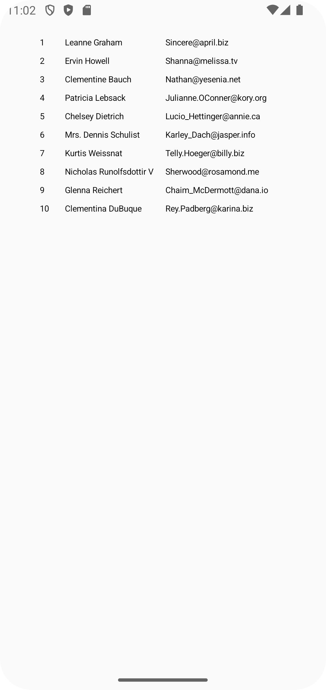
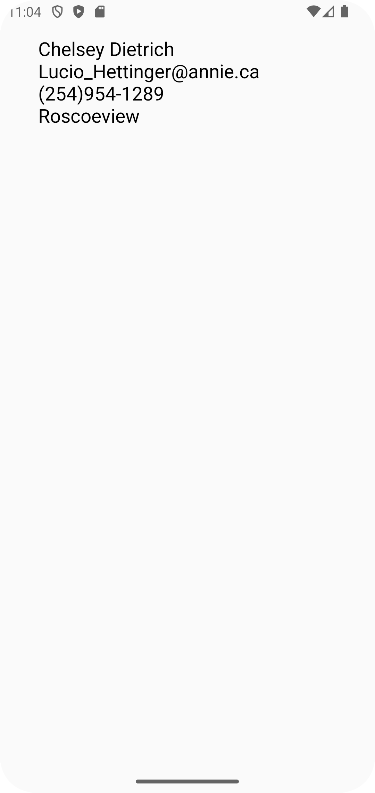

# IDFTechTest

This is a simple Android application that makes an HTTP request to a public API and displays a list
of users. App users can view the details of each loaded user., including their name, email, phone, and city.

## Technologies Used

- **Kotlin**: The programming language used for developing the Android application.
- **Coroutines**: Used for performing asynchronous operations and managing threads.
- **Retrofit**: A library for making HTTP requests to the API.
- **Hilt**: A dependency injection library that simplifies dependency management in the application.
- **Navigation**: A component for managing navigation between the app's screens.
- **Room**: A library for working with an SQLite database, used for caching user data.
- **Mockito**: A library for creating mock objects and testing.

## Installation and Setup

### Prerequisites

- Install [Android Studio](https://developer.android.com/studio) (version 2024.1.1 or higher).
- Ensure that you have the necessary SDKs and tools installed.

### Steps to Run the Application

1. **Open the project in Android Studio:**

- Launch Android Studio.
- Select **File>New>Project from Version Control...**
- Paste the received link into the **URL** box.
- Press the **Clone** button.

2. **Sync dependencies:**

After opening the project, ensure that all dependencies are loaded. 

3. **Run the application:**

- Connect an Android device or launch an emulator.
- Click the "Run" button to run the application.

### Usage

After launching the application, you will see a list of users with their IDs, names, and email
addresses.

Click on a user to open the details screen, where you can view additional information such as phone
and city.

### Testing
The application uses Mockito and JUnit for testing.
To run the tests, select the desired test class, right-clicking, and
choosing "Run".
